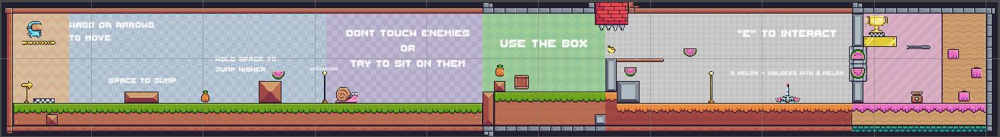
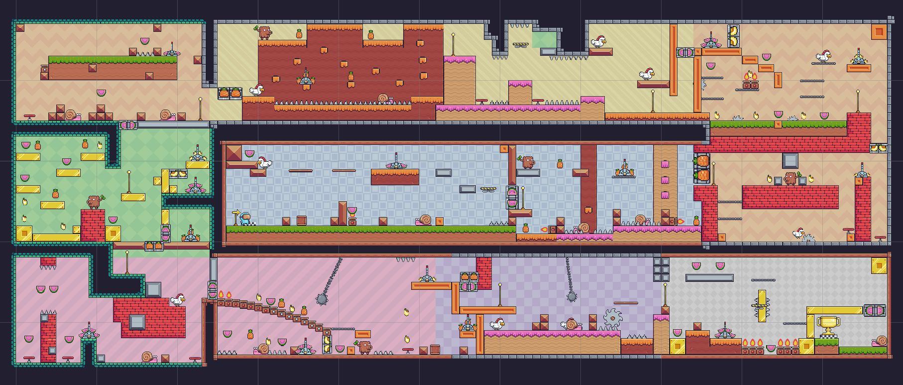
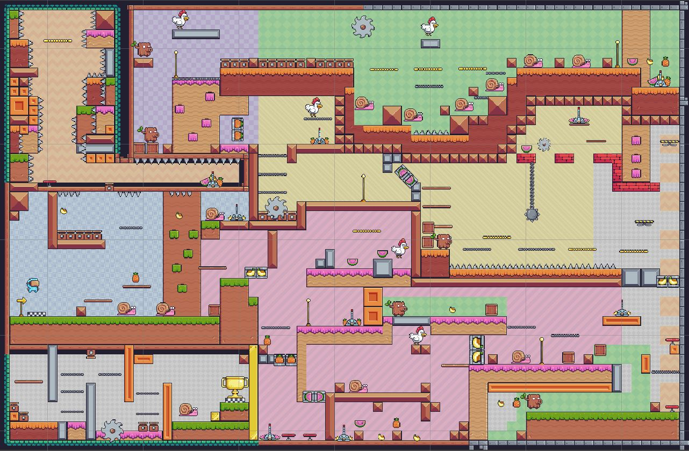
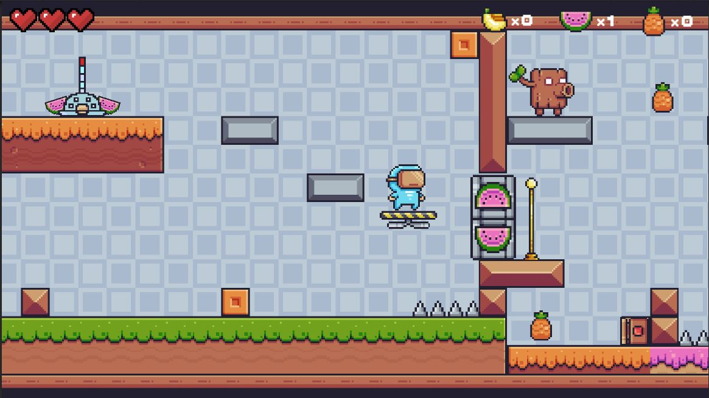
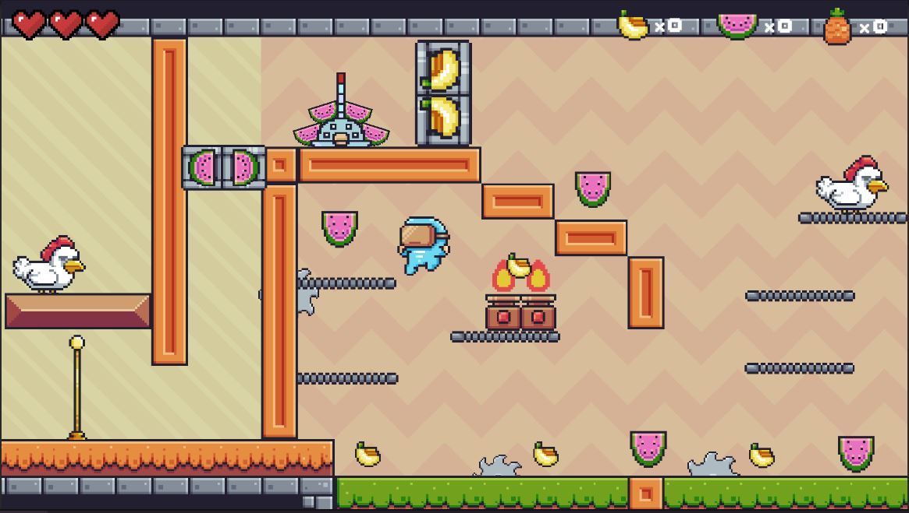
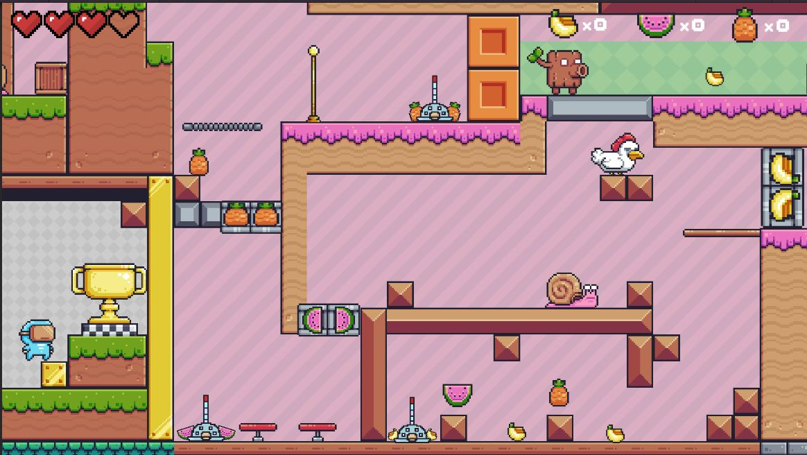
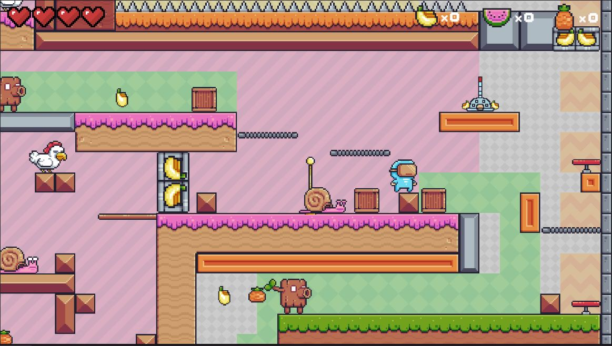

# Pixel Adventure

https://btuhan.itch.io/pixel-adventure
This is a 2D puzzle-platformer game. I used sprites from mainly PixelAdventure asset set which is free and can be downloaded from Unity Assets Store. I needed "lever" sprites so i created one and its animations from Aseprite which can be found in Art folder.

It is a simple platformer game with simple puzzles. Main goal is to reach the endpoint. Player must collect fruits in order to open doors. Doors can be opened with levers which are activated by player if there are enough fruit number and fruit type belonging to lever. This door-lever mechanic is the puzzle system of the game.

### Enemies
I used three enemies: Chicken, Snail and Truck. 
- Truck can detect player with raycast and attack player with projectiles without changing its transform.
- Snail patrols from wall to wall without detecting the player.
- Chickhen runs to the player and follows the player if the player in the range of the chicken.

### Traps
"Traps" that i used:
- Spikes
- Firetraps
- Spikeballs
- Saw
- Trampoline
- Flying platforms

## There are 2 levels and one tutorial section.
Tutorial

Level1

Level2

# InGame
  
  

